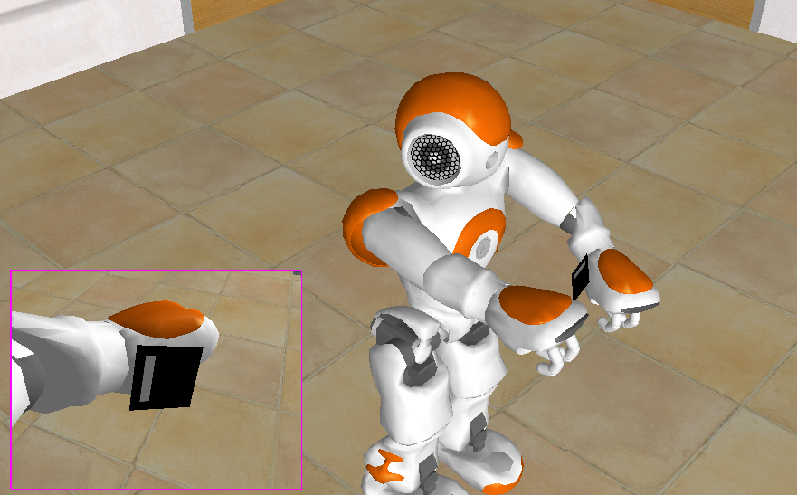

# pynao_exploration
A python implementation of sensorimotor exploration experiments on the Aldebaran Nao robot combining [Explauto](https://github.com/flowersteam/explauto) and [NAOqi](http://doc.aldebaran.com/1-14/dev/naoqi/index.html).

## Scientific Background

Refer to our paper for background information: [Schmerling M., Schillaci G. and Hafner V.V., Goal-Directed Learning of Hand-Eye Coordination on a Humanoid Robot in  *Proceedings of the IEEE 5th International Conference on Development and Learning and on Epigenetic Robotics, pp. 168-175* (2015)](http://robot-ears.eu/wp-content/uploads/Paper_EpiRob_2015_UBER.pdf)

## Prerequisites

- Python 2.7
- [Explauto](https://github.com/flowersteam/explauto)
- [NAOqi 1.14.5]
- [SciPy](http://www.scipy.org/install.html)

## Usage

Have a look at ./tutorial/tutorial.ipynb for an introduction on how to use the implementation.

## Qualitative Results

Have a look at the examplary videos in ./videos/. The results show how the different exploration types behave qualitatively. Goal-directed, curiosity-driven exploration of both head and arm kinematics concurrently was shown to be most effective. The interested reader is referred to our paper for quantative results.

